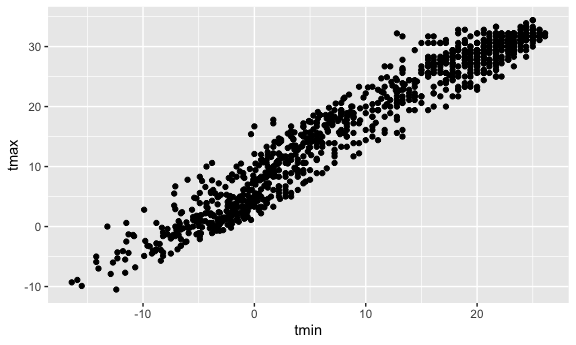
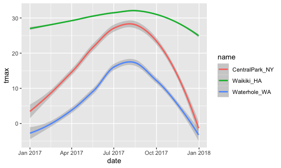
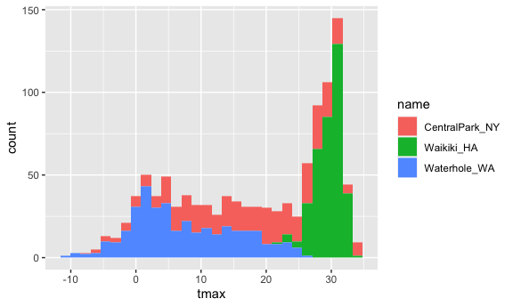
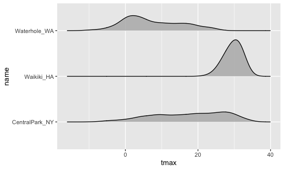
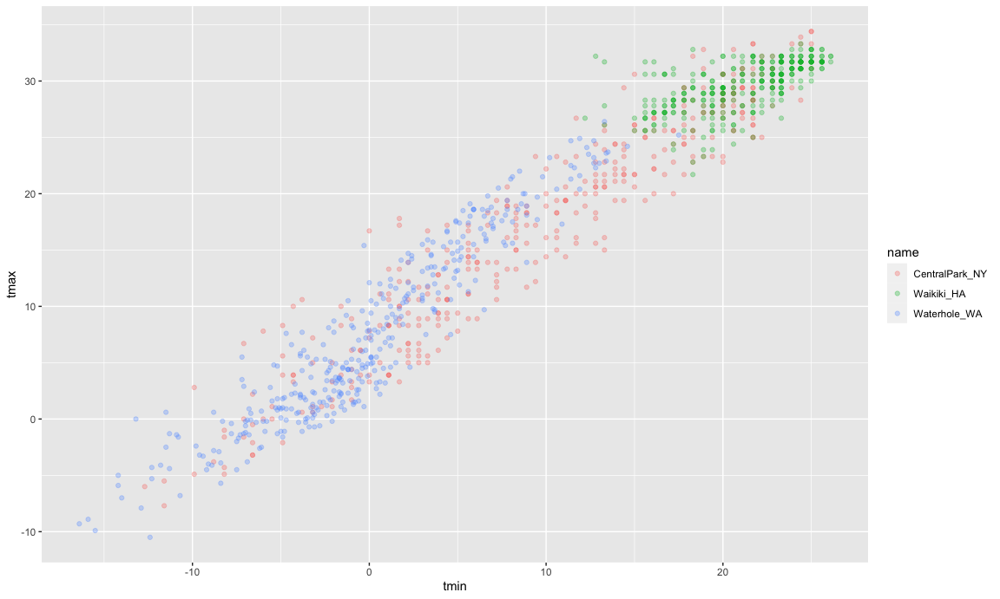

ggplot 1
================

``` r
library(tidyverse)
library(ggridges)

knitr::opts_chunk$set(
  fig.width = 6,
  fig.asp = .6,
  out.width = "90%"
)
```

Loading Dataset that we will use often:

``` r
weather_df = 
  rnoaa::meteo_pull_monitors(
    c("USW00094728", "USC00519397", "USS0023B17S"),
    var = c("PRCP", "TMIN", "TMAX"), 
    date_min = "2017-01-01",
    date_max = "2017-12-31") %>%
  mutate(
    name = recode(
      id, 
      USW00094728 = "CentralPark_NY", 
      USC00519397 = "Waikiki_HA",
      USS0023B17S = "Waterhole_WA"),
    tmin = tmin / 10,
    tmax = tmax / 10) %>%
  select(name, id, everything())
```

    ## Registered S3 method overwritten by 'hoardr':
    ##   method           from
    ##   print.cache_info httr

    ## using cached file: ~/Library/Caches/R/noaa_ghcnd/USW00094728.dly

    ## date created (size, mb): 2021-10-05 10:31:11 (7.602)

    ## file min/max dates: 1869-01-01 / 2021-10-31

    ## using cached file: ~/Library/Caches/R/noaa_ghcnd/USC00519397.dly

    ## date created (size, mb): 2021-10-05 10:31:16 (1.697)

    ## file min/max dates: 1965-01-01 / 2020-02-29

    ## using cached file: ~/Library/Caches/R/noaa_ghcnd/USS0023B17S.dly

    ## date created (size, mb): 2021-10-05 10:31:19 (0.912)

    ## file min/max dates: 1999-09-01 / 2021-09-30

## Scatterplots

``` r
weather_df %>%
  ggplot(aes(x = tmin, y = tmax)) +
  geom_point()
```



You can save ggplots as well:

``` r
ggp_tmax_tmin =
  weather_df %>%
  ggplot(aes(x = tmin, y = tmax)) +
  geom_point()
```

## Let’s fancy it up!

``` r
weather_df %>%
  ggplot(aes(x = tmin, y = tmax, color = name)) +
  geom_point(alpha = 0.3) +
  geom_smooth(se = FALSE) +
  facet_grid(. ~ name)
```

    ## `geom_smooth()` using method = 'loess' and formula 'y ~ x'


One more scatterplot:

``` r
weather_df %>%
  ggplot(aes(x = date, y = tmax, size = prcp)) +
  geom_point(alpha = .3) +
  facet_grid(. ~ name) +
  geom_smooth(se = FALSE)
```

    ## `geom_smooth()` using method = 'loess' and formula 'y ~ x'


## Use data manipulation as part of this

``` r
weather_df %>%
  filter(name == "CentralPark_NY") %>%
  mutate(
    tmax = tmax * (9/5) + 32,
    tmin = tmin * (9/5) + 32
  ) %>%
  ggplot(aes(x = tmin, y = tmax)) +
  geom_point() 
```


# Stacking geoms

``` r
weather_df %>%
  ggplot(aes(x = date, y = tmax, color = name)) +
  geom_smooth()
```

    ## `geom_smooth()` using method = 'loess' and formula 'y ~ x'



## Fancy hexagon scatterplots

``` r
ggplot(weather_df, aes(x = tmax, y = tmin)) + geom_hex()
```


# Histograms

``` r
weather_df %>%
  ggplot(aes(x = tmax, fill = name)) + 
  geom_histogram()
```

    ## `stat_bin()` using `bins = 30`. Pick better value with `binwidth`.



# Boxplots

``` r
weather_df %>%
  ggplot(aes(x = tmax, fill = name)) + 
  geom_boxplot()
```


# Violin Plots

``` r
weather_df %>%
  ggplot(aes(x = name, y = tmax, fill = name)) + 
  geom_violin()
```


# Density Plots

``` r
weather_df %>%
  ggplot(aes(x = tmax, y = name)) + 
  geom_density_ridges(alpha = 0.8, scale = 0.8)
```

    ## Picking joint bandwidth of 1.84



## Embedded plots

``` r
weather_df %>%
  ggplot(aes(x = tmin, y = tmax, color = name)) +
  geom_point(alpha = 0.3)
```


